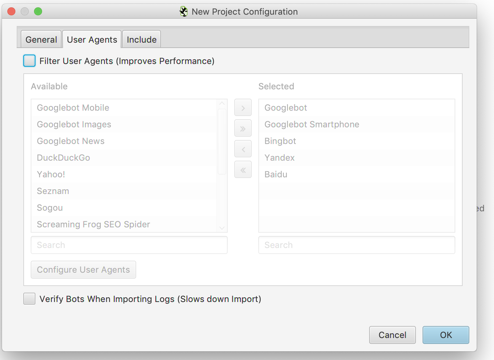
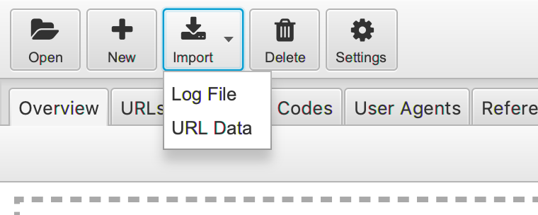

# SFCC E-CDN log transformer
Tool for converting Salesforce Commerce Cloud CloudFlare eCDN-WAF log to standard log formats like W3C

SFCC provides multiple ways to generate eCDN-WAF log files. One of the way is to use [OCAPI](https://documentation.b2c.commercecloud.salesforce.com/DOC1/topic/com.demandware.dochelp/Admin/WAF_LogOCAPIReferences.html?) to download these log files.

[W3C log format](https://www.w3.org/TR/WD-logfile.html) is an official standard. These are plain text files.

W3C log format is one of the format which is accepted by SEO log file analyzer like [Screaming Frog](https://www.screamingfrog.co.uk/log-file-analyser/). Other log format supported by Screaming Frog are Apache Logs, HAProxy

## Usage

```python
python3 log_transformer.py -h
usage: log_transformer.py [-h] [-i INPUT] [-o OUTPUT] [-f FORMAT] [-s]

optional arguments:
  -h, --help  show this help message and exit
  -i INPUT    Existing Input directory from which SFCC logs file will be read
  -o OUTPUT   Existing Output directory to which transformed W3C logs will be
              written
  -f FORMAT   Output log format. Eg: Apache, W3C
  -s          SFCC cache fingerprint will be removed from URL
```

## Screaming Frog Usage

1. Download Screaming Frog Log analyzer from [official site](https://www.screamingfrog.co.uk/log-file-analyser/)
2. Once installed Click "New"

3. Enter name of the project

4. Click User-Agent tab & un-check "Filter User Agents"

5. Once project is created, Click Import > Log File



6. Select the log files
